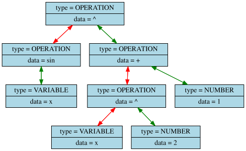
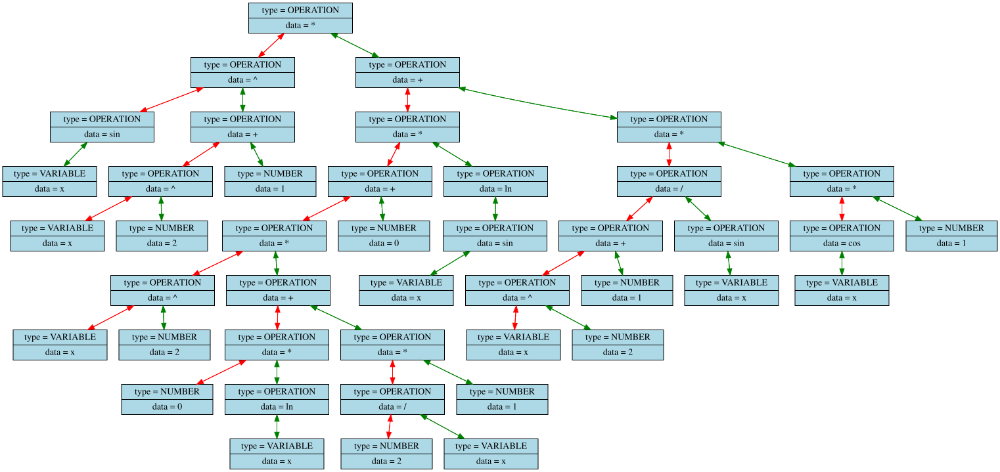
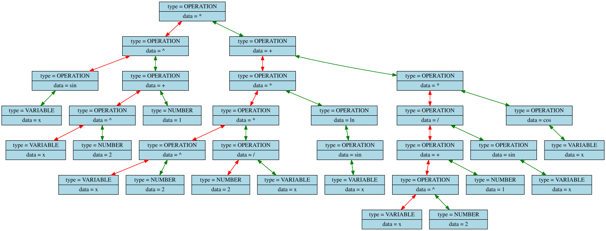

# Differentiator

## Grammar

```txt
// []  - works exactly 1 time
// ()  - works 0 or 1 time
// []* - works >= 1 times
// ()* - works >= 0 times

GetExpr    := GetAddSub TOKEN_TYPE_NULL_TERMINATOR

GetAddSub  := GetMulDiv  (['+', '-'] GetMulDiv )*
GetMulDiv  := GetPow     (['*', '/'] GetPow    )*
GetPow     := GetPrimary ('^'        GetPrimary)*
GetPrimary := GetConst | GetFunc | GetVar | "(" GetExpr ")"

GetFunc  := [
        "sqrt", "ln"  , "log" ,
        "sin",  "cos" , "tan" , "cot" , 
        "sinh", "cosh", "tanh", "coth", 
        "asin", "acos", "atan", "acot"
    ] "(" GetExpr ")"

GetVar   := ['_', 'A'-'Z', 'a'-'z'] ('_', 'A'-'Z', 'a'-'z', '0'-'9')*
GetConst := ['0'-'9']* ("." ['0'-'9']*)*
```

## Example

### Original



### Differentiated




### Optimized



